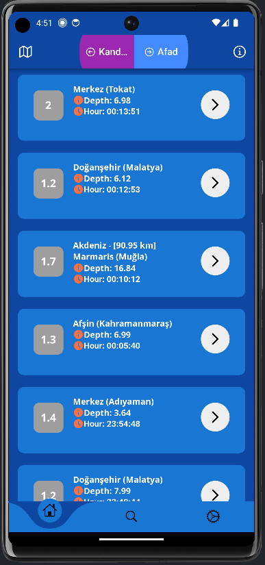
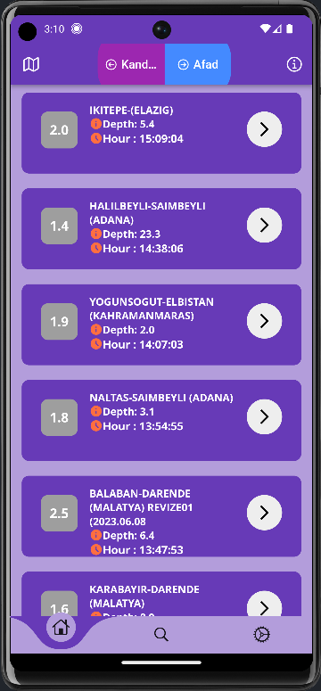

# Earthquake Tracking Application

A comprehensive earthquake tracking application that provides real-time earthquake data from both Kandilli Observatory and AFAD (Disaster and Emergency Management Presidency) sources.


## Features

- 📍 **Real-time Earthquake Data**: Access earthquake information from both Kandilli Observatory and AFAD sources
- 🔍 **Location-based Search**: Search earthquakes by specific locations
- 🗺️ **Interactive Map View**: Visualize earthquake-affected regions on an interactive map
- 🔔 **Customizable Notifications**: Set up personalized earthquake alerts
- 📱 **Cross-platform Support**: Available for Android, iOS, Windows, Linux, and macOS

## Screenshots

### Main Features


_Comprehensive view of all earthquakes_


_Search earthquakes by specific location_

### Settings and Sources


_Customize your notification settings_


_AFAD (Disaster and Emergency Management Presidency) data integration_


_Kandilli Observatory data integration_

## Getting Started

### Prerequisites

- Flutter SDK
- Dart SDK
- Android Studio / Xcode (for mobile development)
- VS Code (recommended for development)

### Installation

1. Clone the repository:

```bash
git clone https://github.com/yourusername/earthquake_project.git
```

2. Navigate to the project directory:

```bash
cd earthquake_project
```

3. Install dependencies:

```bash
flutter pub get
```

4. Run the application:

```bash
flutter run
```

## Features in Detail

### Earthquake Data Sources

- **Kandilli Observatory**: Access to real-time earthquake data from Kandilli Observatory
- **AFAD**: Integration with AFAD's earthquake monitoring system

### Search Functionality

- Search earthquakes by location
- Filter results by magnitude, date, and region
- View detailed information about each earthquake

### Map Integration

- Interactive map showing earthquake locations
- Visual representation of affected areas
- Detailed information on earthquake impact zones

### Notification System

- Customizable alert thresholds
- Location-based notifications
- Magnitude-based filtering

## Contributing

Contributions are welcome! Please feel free to submit a Pull Request.


## Acknowledgments

- Kandilli Observatory for providing earthquake data
- AFAD for their comprehensive disaster management data
- Flutter team for the amazing framework
